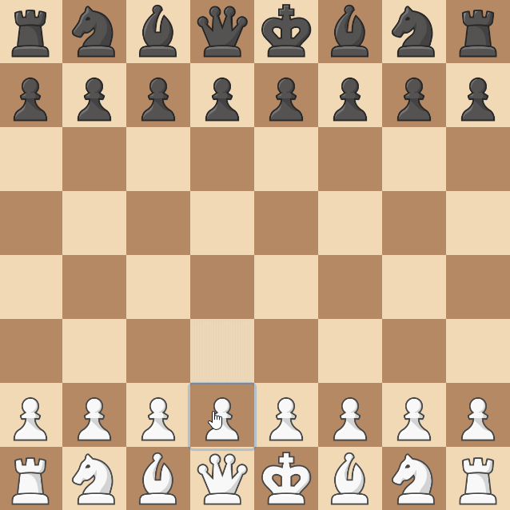

# Forced En Passant

## Introduction

This rule is pretty simple to define, and it works similarly to how the king works.
When a certain condition is met, we force all the player's pieces to make only specific moves.

In the king's case, the condition is that the king can't be attacked.
And in our case, the condition is that the player can en passant.

## Structuring the Rule
After a turn changed:

- For all

    * Pawns of a player.

- We need to

    * Check if the pawn can en passant.

And if any of the pawns can:

- For all

    * Pieces of the same player.

- We need to

    * Remove all moves that aren't en passant.


```python title="forced_en_passant.py"
from collections import defaultdict

from chessmaker.chess.base.board import Board
from chessmaker.chess.base.game import AfterTurnChangeEvent
from chessmaker.chess.base.piece import BeforeGetMoveOptionsEvent
from chessmaker.chess.base.player import Player
from chessmaker.chess.base.rule import Rule
from chessmaker.events import EventPriority

class ForcedEnPassant(Rule):
    def __init__(self, can_en_passant: dict[Player, bool] = None):
        if can_en_passant is None:
            can_en_passant = defaultdict(lambda: False)
        self.can_en_passant: dict[Player, bool] = can_en_passant

    def on_join_board(self, board: Board):
        board.subscribe(BeforeGetMoveOptionsEvent, self.on_before_get_move_options, EventPriority.LOW)
        board.subscribe(AfterTurnChangeEvent, self.on_turn_change)

    def on_turn_change(self, event: AfterTurnChangeEvent):
        pass

    def on_before_get_move_options(self, event: BeforeGetMoveOptionsEvent):
        pass

    def clone(self):
        return ForcedEnPassant(can_en_passant=self.can_en_passant.copy())
```

## Implementing the Rule

Here too, use the annotations to help you understand what's going on.

### Checking if any pawn can en passant

```python
from chessmaker.chess.pieces import Pawn

  def on_turn_change(self, event: AfterTurnChangeEvent):
      for player in event.board.players: # (1)
          self.can_en_passant[player] = False
          
          for piece in event.board.get_player_pieces(player): 
            
              if isinstance(piece, Pawn): # (2)
                  move_options = piece.get_move_options()
                  
                  if any(move_option.extra.get("en_passant") for move_option in move_options): # (3)
                      self.can_en_passant[player] = True
                      break # (4)
```

1. For each player.
2. For each pawn of the player.
3. If any of the pawn's move options is an en passant.
4. If any of the player's pawns can en passant, we don't need to check the other pawns.

### Removing all other move options
```python
from chessmaker.chess.base.piece import BeforeGetMoveOptionsEvent

  def on_before_get_move_options(self, event: BeforeGetMoveOptionsEvent):
      if self.can_en_passant[event.piece.player]: # (1)
          move_options = []
          for move_option in event.move_options: 
              if move_option.extra.get("en_passant"): # (2)
                  move_options.append(move_option)
          event.set_move_options(move_options) # (3)
```

1. If the player can en passant.
2. Keep only the move options that are en passant.
3. Set the move options to the new list.

## Finishing Up


Now that we've implemented our rule, we can add it to the board:

```python
board = Board(
    ...
    rules=[ForcedEnPassant()]
)
```

And that's it! We've implemented a rule that makes en passant forced when it's possible. 
Let's see it in action:

