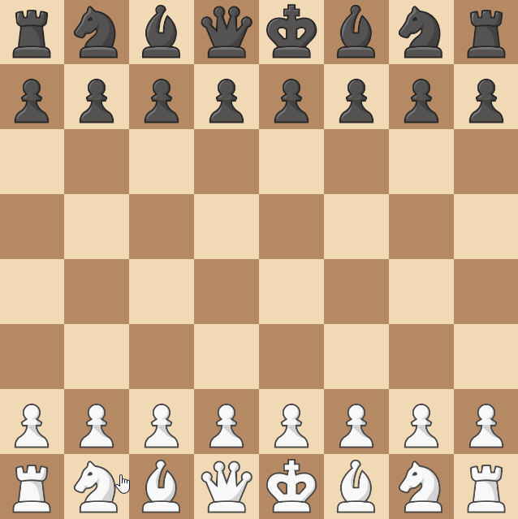

# Knook

## Introduction

A Knook is a new piece that can move both like a knight and a rook.
It is created by merging a knight and a rook of the same player.

While this rule could be implemented with 1 new piece and a 1 new rule,
We're going to implement it with 3 new pieces and no rules - 
to demonstrate the flexibility of creating new variants.

The first thing we need to do is create the Knook piece.
Then, we'll add a way for the knight and the rook to be merged into one.

!!! tip
    If you're just looking for how to create a new piece, don't be
    scared by the length of this tutorial. Most of it is just for the merging.

## The Knook Itself

### Implementing the Piece

The Knook can move like a knight and a rook.
We can ue functions in `piece_utils` to help us implement this.

```python title="knook.py"
from functools import partial
from typing import Iterable

from chessmaker.chess.base.move_option import MoveOption
from chessmaker.chess.base.piece import Piece
from chessmaker.chess.piece_utils import filter_uncapturable_positions, is_in_board, \
    get_straight_until_blocked, positions_to_move_options

MOVE_OFFSETS = [(1, 2), (2, 1), (2, -1), (1, -2), (-1, -2), (-2, -1), (-2, 1), (-1, 2)] # (1)

class Knook(Piece):
    @classmethod
    @property
    def name(cls):
        return "Knook" # (2)

    def _get_move_options(self) -> Iterable[MoveOption]: # (3)
        positions = [self.position.offset(*offset) for offset in MOVE_OFFSETS] 
        positions = filter(partial(is_in_board, self.board), positions)
        positions = filter_uncapturable_positions(self, positions) # (4)

        positions += filter_uncapturable_positions(self,
            get_straight_until_blocked(self)
        ) # (5)

        return positions_to_move_options(self.board, positions) # (6)

    def clone(self):
        return Knook(self.player)
```

1. We could have also used the knight's `MOVE_OFFSETS` constant.
2. The name of the piece is used for display purposes, and it's a class property.
3. The `_get_move_options` method is called when the piece is asked for its move options.
   It returns an iterable of `MoveOption` objects.
4. We get all of a Knight's move options, filter out the ones that are out of the board,
   and filter out the ones that are blocked by a piece of the same player.
5. We add all of a Rook's move options, and filter out the ones that are blocked by
a piece of the same player.
6. We return the move options as a list of `MoveOption` objects. The `positions_to_move_options`
   function is a helper function adds the `captures` argument if the position is occupied by
   a piece.

### Making it displayable

The UI is independent of the game logic. And theoretically, you could use any UI you want.
However, since ChessMaker is packaged with a UI, this tutorial will also show how to add
the Knook to it.

The `start_pywebio_chess_server` function accepts an optional PIECE_URLS argument.
The argument is a dictionary where the keys are the names of the pieces, and the values
are tuples of URLs, with as many amount of players you want to support.

The `pywebio_ui` also exposes a `PIECE_URLS` constant, which is a dictionary of the default
pieces. We can use it to create a new dictionary with the Knook.

```python title="main.py"
from chessmaker.clients.pywebio_ui import start_pywebio_chess_server, PIECE_URLS

if __name__ == "__main__":
    start_pywebio_chess_server(
        create_game,
        piece_urls=PIECE_URLS | {"Knook": ("https://i.imgur.com/UiWcdEb.png", "https://i.imgur.com/g7xTVts.png")}
    )
```

And that's it for the new piece! If we didn't want to have the piece created by merging,
this would be very simple. However, we have some more work to do.

## Implementing merging

Now that we have the Knook, we need to implement a way to create it by
merging a knight and a rook.

As mentioned before, this is possible to do by creating a new rule,
but for the sake of this tutorial, we'll implement it with 2 new pieces.
We'll create a `KnookableKnight` and a `KnookableRook`.

Because both the new knight and the new rook need to have similar logic (yet not identical),
we'll create a few helper functions that will be used by both pieces.

### Knookable

First, we'll define an empty interface called `Knookable` that will let
a mergeable piece know that it can be merge with another piece.

```python

class Knookable:
    pass
```

### Getting the merge move options

Then, we'll create a helper function that will return move options that
are available for merging.

The idea is that a piece will provide where it can move to,
and the merge move options will return the MoveOptions that are
occupied by a piece that it can be merged with it,
along with extra information about the merge in the move option,
so that the merge can be done later.

```python
from typing import Iterable

from chessmaker.chess.base.move_option import MoveOption
from chessmaker.chess.base.piece import Piece
from chessmaker.chess.base.position import Position
from chessmaker.chess.pieces.knook.knookable import Knookable


def get_merge_move_options(piece: Piece, positions: Iterable[Position]) -> Iterable[MoveOption]:
    for position in positions:
        position_piece = piece.board[position].piece

        if position_piece is not None and position_piece.player == piece.player: # (1)
            if isinstance(position_piece, Knookable) and not isinstance(position_piece, type(piece)): # (2)
                yield MoveOption(position, extra=dict(knook=True)) # (3)

```

1. We only want to merge with pieces of the same player.
2. We only want to merge with pieces that are Knookable, and not the same type as the piece
   (e.g. we can't merge a knight with another knight).
3. We return a move option with the `knook` extra argument set to `True`,
   so that we can later easily know that this move option is for merging.

### Performing the merge

We'll create another helper function that will perform the merge,
given an `AfterMoveEvent` event - and both of our new pieces will
subscribe to it with that function.

To make our rule extendible, we'll also publish events when a merge
occurs - but because these are new events that are not part of the core game,
it's up to us how and what to publish.

```python
from dataclasses import dataclass

from chessmaker.chess.base.piece import Piece, AfterMoveEvent
from chessmaker.chess.pieces.knook.knook import Knook
from chessmaker.events import Event

@dataclass(frozen=True)
class AfterMergeToKnookEvent(Event):
    piece: Piece # (1)
    knook: Knook


class BeforeMergeToKnookEvent(AfterMergeToKnookEvent):
    def set_knook(self, knook: Knook): # (2)
        self._set("knook", knook) # (3)

def on_after_move(event: AfterMoveEvent): # (4)
    if event.move_option.extra.get("knook"): # (5)
        piece = event.piece
        before_merge_to_knook_event = BeforeMergeToKnookEvent(
            piece,
            Knook(event.piece.player)
        ) # (6)
        event.piece.publish(before_merge_to_knook_event)
        
        knook = before_merge_to_knook_event.knook # (7)
        piece.board[event.move_option.position].piece = knook # (8)
        
        piece.publish(AfterMergeToKnookEvent(piece, knook))
```

1. Because of how we implemented this, we're not able to provide both the
   rook and the knight in the event, so we just provide the piece that
   initiated the merge. This isn't a problem, because this is our own event.
2. We create a `BeforeMergeToKnookEvent` event that will allow subscribers to
   change the `Knook` object that will be created.
3. We use the `Event`s `_set` method to change the `knook` attribute,
   which can't be changed regularly (because we want the rest of the event to be immutable).
4. We're subscribing to the `AfterMoveEvent` event - meaning at the time
   this function is called, the initiating piece has moved to the piece it
   wants to merge with - which is now not on the board anymore. Now we just
   have to change the piece on the new position to a `Knook`.
5. We check if the move option has the `knook` extra argument set to `True`.
6. We create the `BeforeMergeToKnookEvent` event in a separate variable,
   so that we can still access it after we publish it.
7. We get the `knook` object from the event, so that subscribers can change it.
8. Finally, we change the piece on the new position to a knook.

### The new pieces

A tricky part here is that it's very tempting to think we can just
pass the Knight and Rook's move options to the `get_merge_move_options` - 
but in fact, those move options already filtered out positions where
there's a piece of the same player, so we'll have to re-create the move options
partially.

We'll still want to inherit from the Knight and Rook, so that pieces
which check for the type of the piece (using `isinstance`) will still work.

The annotations here will only be for the `KnookableKnight` class,
since it's about the same for both.

```python
from functools import partial
from itertools import chain
from typing import Iterable

from chessmaker.chess.base.move_option import MoveOption
from chessmaker.chess.base.piece import AfterMoveEvent
from chessmaker.chess.base.player import Player
from chessmaker.chess.pieces import knight
from chessmaker.chess.pieces.knight import Knight
from chessmaker.chess.pieces.knook.knookable import Knookable
from chessmaker.chess.piece_utils import is_in_board, get_straight_until_blocked
from chessmaker.chess.pieces.rook import Rook
from chessmaker.chess.pieces.knook.merge_to_knook import get_merge_move_options, merge_after_move, \
    MERGE_TO_KNOOK_EVENT_TYPES
from chessmaker.events import EventPriority, event_publisher


@event_publisher(*MERGE_TO_KNOOK_EVENT_TYPES) # (1)
class KnookableKnight(Knight, Knookable):
    def __init__(self, player):
        super().__init__(player)
        self.subscribe(AfterMoveEvent, merge_after_move, EventPriority.VERY_HIGH) # (2)

    def _get_move_options(self):
        positions = [self.position.offset(*offset) for offset in knight.MOVE_OFFSETS] # (3)
        positions = list(filter(partial(is_in_board, self.board), positions))
        merge_move_options = get_merge_move_options(self, positions) # (4)

        return chain(super()._get_move_options(), merge_move_options) # (5)

    def clone(self):
        return KnookableKnight(self.player)


@event_publisher(*MERGE_TO_KNOOK_EVENT_TYPES)
class KnookableRook(Rook, Knookable):
    def __init__(self, player: Player, moved: bool = False):
        super().__init__(player, moved)
        self.subscribe(AfterMoveEvent, merge_after_move, EventPriority.VERY_HIGH)

    def _get_move_options(self) -> Iterable[MoveOption]:
        positions = list(get_straight_until_blocked(self))
        merge_move_options = get_merge_move_options(self, positions)

        return chain(super()._get_move_options(), merge_move_options)

    def clone(self):
        return KnookableRook(self.player, self.moved)
```

1. While it's clear that we need to inherit from `Knight` and `Knookable`,
   we also want to inherit from `EventPublisher` - because we want to specify
   we're publishing more events than the base `Piece` class. This isn't
   necessary, but it's good practice.
2. We subscribe to the `AfterMoveEvent` with the helper function we created
   earlier. It's a good practice to set the priority to `VERY_HIGH` when subscribing 
   to your own events, because you want all other subscribers to have the changes
   you make.
3. If we didn't know the knight's `MOVE_OFFSETS` constant, we would just create
   our own.
4. We get the positions the knight can move to, without filtering positions
   where there's a piece of the same player, and instead filter them
   (and convert to move options) using the `get_merge_move_options` function.
5. We add the move options from the `get_merge_move_options` function to the
   move options from the `Knight` class. We could have also just created
   the Knight's move options, since we already did some of the work needed for it.

## Finishing up

Now that we have both our new pieces, we're almost done!
We just need to create a board that uses our Knookable pieces.
It's also important to remember to use it in other references to Knight and Rook 
in the board creation, such as in promotion - otherwise the promotion
will create an unmergeable piece.

```python
board = Board(
    squares=[
        [KnookableRook(black), KnookableKnight(black), ...],
        [Pawn(black, Pawn.Direction.DOWN, promotions=[KnookableKnight, KnookableRook, ...])],
        ...
    ],
    ...
)
```

And that's it! We now have a fully functional chess game with a new piece.
Let's see it in action:


