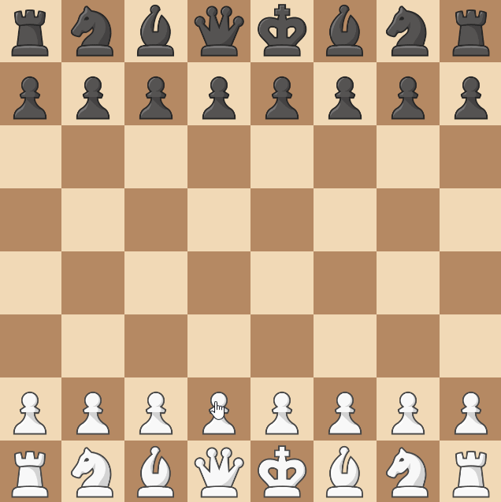

# Omnipotent F6 Pawn

## Introduction

For this rule, we're going to implement something quite special.

The Omnipotent F6 Pawn rule is another rule that originated from [r/AnarchyChess](https://www.reddit.com/r/AnarchyChess/).
Without getting into it's history, the rule makes it so that if the enemy has a piece
on the F6 square, then a pawn can be summoned there instead.

## Designing the Rule

Creating a rule like this is tricky. It challenges some assumptions that we've made
like that each move belongs to a piece. Luckily, ChessMaker's flexibility allows us
to implement this rule without breaking any of the assumptions.

What we're going to do is make it so each piece has an extra move option that
summons a pawn to the F6 square - and doesn't affect the piece itself.

We'll do this by using the `BeforeMoveEvent.set_cancelled()` method.
We'll cancel the move, and instead summon a pawn to the F6 square
(and publish events for it as if it was a regular move).

## Structuring the Rule

So, we want to add a move option to all pieces, and use `BeforeMoveEvent`
once any piece has moved with that move option to cancel the move and summon a pawn instead.

- For all

    * Pieces in the board
  
- We need to

    * Add a move option to the piece
    * Before the piece moves, alter the move option to summon a pawn instead.

```python title="omnipotent_f6_pawn.py"
from typing import Callable

from chessmaker.chess.base.board import Board
from chessmaker.chess.base.piece import BeforeGetMoveOptionsEvent, BeforeMoveEvent
from chessmaker.chess.base.player import Player
from chessmaker.chess.base.position import Position
from chessmaker.chess.base.rule import Rule
from chessmaker.chess.pieces import Pawn
from chessmaker.events import EventPriority

F6 = Position(5, 2) # (1)


class OmnipotentF6Pawn(Rule):
    def __init__(self, pawn: Callable[[Player], Pawn]):
        self._pawn = pawn # (2)

    def on_join_board(self, board: Board):
        board.subscribe(BeforeGetMoveOptionsEvent, self.on_before_get_move_options, EventPriority.HIGH)
        board.subscribe(BeforeMoveEvent, self.on_before_move)

    def on_before_get_move_options(self, event: BeforeGetMoveOptionsEvent):
        pass
    
    def on_before_move(self, event: BeforeMoveEvent):
        pass


    def clone(self):
        return OmnipotentF6Pawn(pawn=self._pawn)
```

1. Notice that while chess notation numbers positions from the bottom left, ChessMaker
   numbers them from the top left. This is because the squares are a 2D array - and
   the first index is the row, and the second is the column.
2. The reason we're not using the `Pawn` class directly is that because it
   accepts more arguments that we don't have - like the pawn's direction
   and what can it promote to.

## Implementing the Rule

Again, use the annotations to help you understand what's going on.

### Adding the Move Option

```python
from itertools import chain
from chessmaker.chess.base.move_option import MoveOption


def on_before_get_move_options(self, event: BeforeGetMoveOptionsEvent):
    f6_piece = event.piece.board[F6].piece

    if f6_piece is not None and f6_piece.player != event.piece.player: # (1)
        move_option = MoveOption(F6, extra=dict(summon_pawn=True), captures={F6}) # (2)
        event.set_move_options(chain(event.move_options, [move_option])) # (3)
```

1. We only want to add the move option if the F6 square is occupied by an enemy piece.
2. We create a move option that moves to the F6 square, and has an extra
   attribute that we'll use later to know that we need to summon a pawn.
3. Because move options are an iterable and not a list, we need to use the
   `chain` function to add the move option to the existing move options.

### Summoning the Pawn

```python
from chessmaker.chess.base.piece import AfterMoveEvent, BeforeCapturedEvent AfterCapturedEvent


def on_before_move(self, event: BeforeMoveEvent):
    if event.move_option.extra.get("summon_pawn"):
        captured_piece = event.piece.board[F6].piece  # (1)
        captured_piece.publish(BeforeCapturedEvent(captured_piece)) # (2)

        pawn = self._pawn(event.piece.player)
        event.piece.board[F6].piece = pawn  # (3)

        captured_piece.publish(AfterCapturedEvent(captured_piece))
        pawn.publish(AfterMoveEvent(pawn, event.move_option)) # (4)

        event.set_cancelled(True)  # (5)
```

1. We save the captured piece so we can publish the `AfterCaptureEvent` later.
2. We only publish a `BeforeCapturedEvent` and not a `BeforeMoveEvent` event because
   the `BeforeMoveEvent` event has already been published (we're a subscriber to it).
3. We create a new pawn and place it on the F6 square.
4. We publish the move event for the pawn - and not for the piece that made the move.
   This is because that piece isn't actually the one moving, as mentioned before.
5. We cancel the actual move - because we don't want the piece to move
   (And because we don't want 2 move events to be published).


## Finishing Up

Again, all that's left is to add the rule to the board. Though this time it requires
a bit more work:

```python
def _pawn(player: Player):
    if player == white:
        return Pawn(white, Pawn.Direction.UP, promotions=[Bishop, Rook, Queen, Knight])
    elif player == black:
        return Pawn(black, Pawn.Direction.DOWN, promotions=[Bishop, Rook, Queen, Knight])

board = Board(
    ...
    rules=[OmnipotentF6Pawn(pawn=_pawn)]
)
```

And that's it! This was probably the most complicated rule we've made so far,
and it shows how we can do almost anything with ChessMaker.



