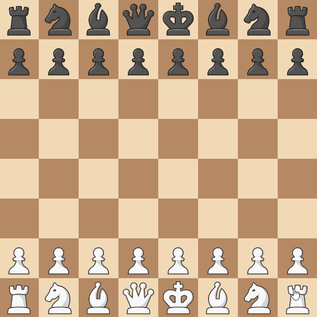

# Siberian Swipe

## Introduction 

Siberian Swipe is a rule that originated from [r/AnarchyChess](https://www.reddit.com/r/AnarchyChess/).
With rules like this, there's no official place we can find out how it works,
so we have to define it ourselves.

## Defining the Rule

When a rook hasn't moved yet, it can skip any pieces on it's file
in order to capture a distant enemy rook.

## Structuring the Rule

Now that we know what the rule does, we can start building our rule.
Because our rule only applies to Rooks - we only need to subscribe to
rook events. And because we only need to add to where the rook can move to,
and not how the movement works (We're just capturing a piece - not doing
anything special like summoning a piece or moving a piece to a different
location) - we only need to subscribe to the `BeforeGetMoveOptions` event.

In addition, if rooks are added in the middle of the game (For example by a promotion),
the rule also needs to apply to them. So we need to do 3 things:

- For all

    * Current rooks
    * Rooks that will be added in the future

- We need to

    * Add a capture move option.

```python title="siberian_swipe.py"
from chessmaker.chess.base.rule import Rule
from chessmaker.chess.base.board import AfterNewPieceEvent, Board
from chessmaker.chess.base.piece import Piece, BeforeGetMoveOptionsEvent
from chessmaker.chess.pieces.rook import Rook
from chessmaker.events import EventPriority

class SiberianSwipe(Rule):
    def on_join_board(self, board: Board):
        for piece in board.get_pieces():
            self.subscribe_to_piece(piece)
        board.subscribe(AfterNewPieceEvent, self.on_new_piece)

    def subscribe_to_piece(self, piece: Piece):
        if isinstance(piece, Rook):
            piece.subscribe(BeforeGetMoveOptionsEvent, self.on_before_get_move_options, EventPriority.HIGH) # (1)

    def on_new_piece(self, event: AfterNewPieceEvent):
        self.subscribe_to_piece(event.piece)

    def on_before_get_move_options(self, event: BeforeGetMoveOptionsEvent):
        pass # (2)

    def clone(self):
        return SiberianSwipe() # (3)
```

1. When adding move options, it's generally a good idea to add them with a high priority.
So that rules which remove options will be able to run after this rule and remove it if needed.
2. We'll implement this later. 
3. Because our rule is stateless, we don't have to do anything special when cloning it.

## Implementing the Rule

Now all that's left to do is implement `on_before_get_move_options`.
Use the annotations to help you understand what's going on.

```python title="siberian_swipe.py"
from itertools import chain

from chessmaker.chess.base.move_option import MoveOption
from chessmaker.chess.base.piece import BeforeGetMoveOptionsEvent
from chessmaker.chess.piece_utils import is_in_board
from chessmaker.chess.pieces.rook import Rook

  def on_before_get_move_options(self, event: BeforeGetMoveOptionsEvent):
      move_options = event.move_options
      rook: Rook = event.piece
      board = event.piece.board # (1)
      player = event.piece.player
      position = event.piece.position
      new_move_options = []

      if rook.moved: # (2)
          return

      for direction in [(0, 1), (0, -1)]: # (3)
          enemy_position = position.offset(*direction)

          while is_in_board(board, enemy_position): # (4)
              enemy_piece = board[enemy_position].piece

              if isinstance(enemy_piece, Rook) and enemy_piece.player != player: # (5)
                  move_option = MoveOption(
                      enemy_position,
                      captures={enemy_position},
                      extra=dict(siberian_swipe=True) # (6)
                  )
                  new_move_options.append(move_option)

              enemy_position = enemy_position.offset(*direction)

      event.set_move_options(chain(move_options, new_move_options)) # (7)
```

1. As mentioned earlier, it is recommended to use the event's board and not the one
passed to us in `on_join_board`.
2. If the rook has moved, it can't do a siberian swipe.
3. We check both up and down.
4. We search for rooks in that direction - ignoring all pieces that might block us,
and use `piece_utils.is_in_board` to check if we reached the edge of the board (or a hole).
5. We want our move to be able to skip over all pieces, so we ignore all pieces that aren't enemy rooks.
6. If there is, we create a move option that captures it. Notice that 
we add `extra=dict(siberian_swipe=True)` to the move option. For our use case,
this is only used for display purposes, but if we wanted to modify how the move works
using the `BeforeMoveEvent` and `AfterMoveEvent` events, we could use this to check
if the move is a siberian swipe.
7. Because the move options are an iterable, we can't just append to them.
Instead, we use itertools.chain to create a new iterable that contains both
the old move options, and the new move option we created.

## Finishing Up

Now that we've implemented our rule, we can add it to the board:

```python
board = Board(
    ...
    rules=[SiberianSwipe()]
)
```

And that's it! We've implemented a rule that adds a new move option to rooks.
Let' see it in action:

